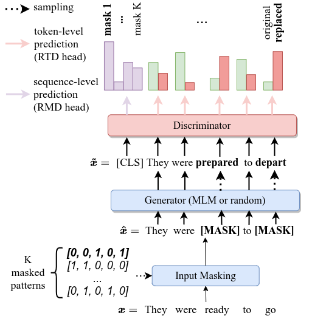
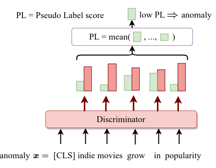

# DATE: Detecting Anomalies in Text via Self-Supervision of Transformers

**[[Paper]](https://arxiv.org/abs/2104.05591v1)**

Leveraging deep learning models for Anomaly Detection (AD) has seen widespread use in recent years due to superior performances over traditional methods. Recent deep methods for anomalies in images learn better features of normality in an end-to-end self-supervised setting. These methods train a model to discriminate between different transformations applied to visual data and then use the output to compute an anomaly score. We use this approach for AD in text, by introducing a novel pretext task on text sequences. We learn our DATE model end-to-end, enforcing two independent and complementary self-supervision signals, one at the token-level and one at the sequence-level. Under this new task formulation, we show strong quantitative and qualitative results on the 20Newsgroups and AG News datasets. In the semi-supervised setting, we outperform state-of-the-art results by +13.5% and +6.9%, respectively (AUROC). In the unsupervised configuration, DATE surpasses all other methods even when 10% of its training data is contaminated with outliers (compared with 0% for the others).

 
 
This repo contains the official implementation of DATE.
